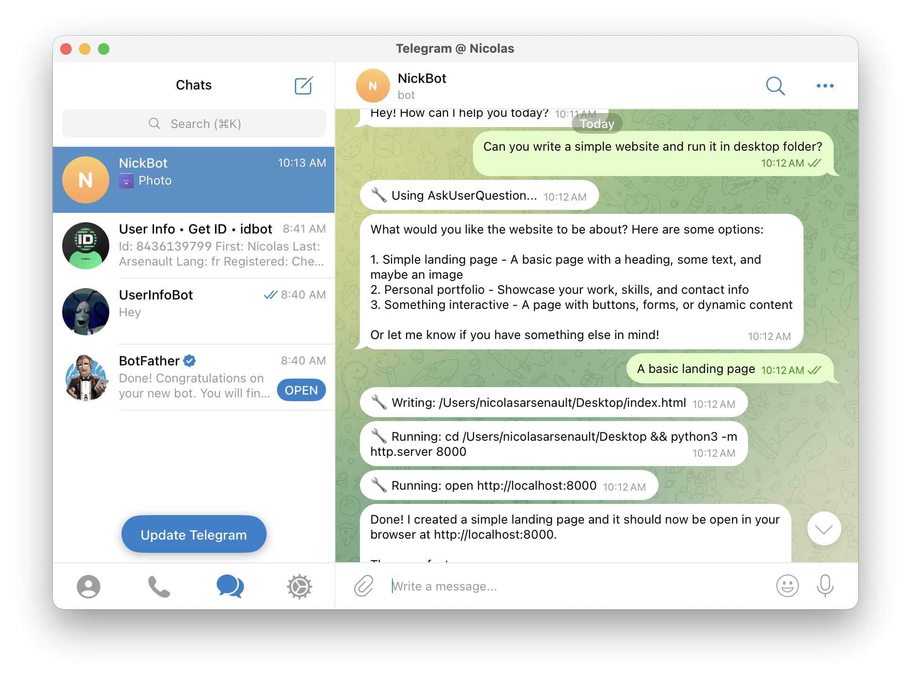
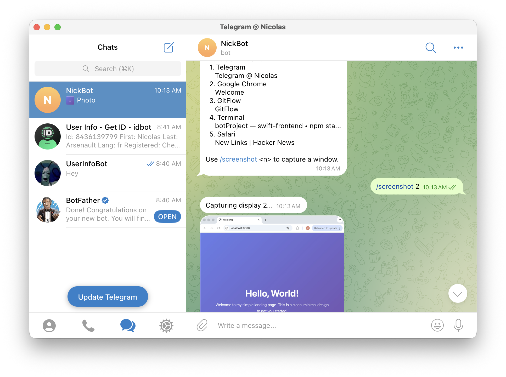

# Claudegram

Control AI coding assistants (Claude Code or OpenAI Codex) from Telegram with full computer access.

[](https://opensource.org/licenses/MIT)

## Overview

Claudegram bridges AI coding assistants to Telegram, letting you interact with them from anywhere. Supports both **Claude Code** and **OpenAI Codex CLI** as backends. The AI has full computer access, enabling file operations, bash commands, and more.

## Screenshots

### Real-time Progress Updates


### Screenshot Capture


## Features

- **Multiple AI Backends** — Choose between Claude Code CLI or OpenAI Codex CLI
- **Full Computer Access** — AI can read/write files, execute commands, etc.
- **Real-time Progress** — See what the AI is doing (reading files, running commands, etc.)
- **Streaming Updates** — Tool usage displayed as it happens, with 30s fallback messages
- **Security Prompts** — Configurable system prompt to require confirmation before actions
- **Image Input** — Send images from Telegram to the AI
- **Screenshots** — Capture and receive screenshots from the host machine
- **Direct Shell Access** — Execute commands directly via `/cmd`
- **Secure Access** — Telegram user ID whitelist

## Architecture

```
Telegram Client
    ↕ (Telegram Bot API)
Claudegram
    ↕ (AI Client Interface)
    ├── Claude Code CLI (--dangerously-skip-permissions)
    └── OpenAI Codex CLI (--full-auto)
    ↕
Your Computer
```

## Requirements

- macOS (screenshot feature is macOS-only)
- Node.js >= 18.0.0
- **One of the following AI CLIs:**
  - Claude Code CLI installed and authenticated (`claude`), OR
  - OpenAI Codex CLI installed and authenticated (`npm i -g @openai/codex && codex auth`)
- Telegram Bot Token (via @BotFather)
- **Screen Recording permission** for screenshots (System Settings > Privacy & Security > Screen Recording)

## Installation

### npm (Recommended)

```bash
npm install -g claudegram
```

After installation, run the bot with:

```bash
claudegram
```

### From Source

```bash
git clone https://github.com/Nicolas-Arsenault/claudegram.git
cd claudegram
npm install
npm run build
```

## Setup

### Creating a Telegram Bot

1. Open Telegram and search for `@BotFather`
2. Start a chat and send `/newbot`
3. Choose a display name for your bot (e.g., "My Claudegram")
4. Choose a username ending in `bot` (e.g., `my_claudegram_bot`)
5. BotFather will reply with your **bot token** — save this securely

```
Done! Congratulations on your new bot. You will find it at t.me/my_claudegram_bot.
Use this token to access the HTTP API:
123456789:ABCdefGHIjklMNOpqrsTUVwxyz
```

### Getting Your Telegram User ID

Your user ID is required for the whitelist. To find it:

1. Search for `@userinfobot` on Telegram
2. Start a chat and send any message
3. The bot replies with your user ID

```
Your user ID: 123456789
```

Alternatively, forward a message from yourself to `@userinfobot`.

### Authenticating Claude Code

Before running Claudegram, ensure Claude Code is authenticated:

```bash
claude
```

This will open a browser for OAuth login with Anthropic. Once authenticated, Claudegram will use those stored credentials.

## Configuration

| Variable | Required | Description |
|----------|----------|-------------|
| `TELEGRAM_BOT_TOKEN` | Yes | Telegram bot API token |
| `ALLOWED_USER_IDS` | Yes | Comma-separated Telegram user IDs |
| `AI_BACKEND` | No | AI backend: `claude` or `codex` (default: `claude`) |
| `SYSTEM_PROMPT_FILE` | No | Path to custom system prompt file (default: `CLAUDE_PROMPT.md` in package root) |
| `SCREENSHOT_OUTPUT_DIR` | No | Screenshot directory (default: `./screenshots`) |
| `INPUT_IMAGE_DIR` | No | Image directory (default: `./inputs`) |
| `SESSION_IDLE_TIMEOUT_MS` | No | Idle timeout in ms (default: 10800000 / 3 hours) |

### Example (Claude Code)

```bash
export TELEGRAM_BOT_TOKEN="123456789:ABCdefGHIjklMNOpqrsTUVwxyz"
export ALLOWED_USER_IDS="123456,789012"
claudegram
```

### Example (OpenAI Codex)

```bash
# Install and authenticate Codex CLI first
npm install -g @openai/codex
codex auth

# Then run Claudegram with Codex backend
export TELEGRAM_BOT_TOKEN="123456789:ABCdefGHIjklMNOpqrsTUVwxyz"
export ALLOWED_USER_IDS="123456,789012"
export AI_BACKEND="codex"
claudegram
```

If installed from source, use `npm start` instead of `claudegram`.

## Usage

### Telegram Commands

| Command | Description |
|---------|-------------|
| `/start` | Start a new Claude session (required before sending messages) |
| `/status` | Check if a session is active |
| `/screenshot` | List available displays |
| `/screenshot <n>` | Capture display n |
| `/interrupt` | Stop current operation (session remains active) |
| `/kill` | Terminate current session |
| `/cmd <command>` | Execute shell command directly (bypasses Claude) |

All other messages are sent to Claude Code (requires active session).

### Progress Updates

While Claude works, you'll see real-time updates:

- `🔧 Reading: src/index.ts` — File being read
- `🔧 Writing: src/config.ts` — File being written
- `🔧 Running: npm test` — Command being executed
- `🔧 Searching for: "pattern"` — Content search
- `💭 Thinking...` — Claude is reasoning
- `⏳ Still working...` — Fallback every 30s if no other activity

**Plan Mode Updates:**
- `📋 Entering Plan Mode` — Claude is planning before executing
- `✅ Plan Approved` — Claude is proceeding with implementation
- `📝 Creating task: ...` — Task being added to plan
- `✏️ Updating task → completed` — Task status change

**User Input Requests:**
- `❓ Claude needs your input:` — Claude is asking a question with options
  - Reply with your choice or a custom response

### Direct Shell Execution

The `/cmd` command executes shell commands directly on the host machine without going through Claude:

```
/cmd ls -la
/cmd git status
/cmd npm test
```

Output includes stdout, stderr, and exit code. Long outputs are automatically split across multiple messages.

### Image Handling

1. Send any image to the bot
2. Image is saved locally
3. Claude is notified with the file path
4. Add a caption for context

## Security

### Access Control

- Only whitelisted Telegram user IDs can interact
- Messages from unauthorized users are silently ignored
- No inbound network ports exposed

### System Prompt

Claudegram includes a default security prompt (`CLAUDE_PROMPT.md` in the package root) that instructs Claude to:

- Ask for confirmation before destructive operations
- Explain what actions it plans to take
- Request approval before modifying or deleting files
- Warn about potentially dangerous commands

The default prompt is automatically loaded regardless of which directory you start the bot from. You can customize this by editing `CLAUDE_PROMPT.md` or setting `SYSTEM_PROMPT_FILE` to an absolute path to a different file.

## Session Model

- **Explicit start** — Use `/start` to create a session (no auto-creation)
- **Persistent context** — AI retains full context within a session via session resume
- **One session per chat** — Each Telegram chat has its own AI instance
- **3-hour timeout** — Sessions end after 3 hours of inactivity (configurable)
- **Interrupt support** — Use `/interrupt` to stop current operation while keeping session
- **Manual termination** — Use `/kill` to end a session early
- **Clean process management** — `/kill` terminates any running AI process

## Connection Resilience

The bot includes automatic recovery mechanisms for long-running deployments:

- **Error handling** — Telegraf errors are caught and logged without crashing
- **Automatic reconnection** — Network failures trigger reconnection with exponential backoff (up to 10 attempts)
- **Health monitoring** — Periodic API checks every 2 minutes; reconnects if no updates for 5 minutes
- **Memory management** — Stale progress tracking entries are cleaned up automatically
- **Global error handlers** — Unhandled rejections and exceptions are logged

## Project Structure

```
src/
├── index.ts              # Entry point
├── config.ts             # Configuration (incl. AI backend selection)
├── sdk/
│   ├── types.ts          # AIClient interface & shared types
│   ├── client.ts         # Claude Code SDK client
│   └── codex-client.ts   # OpenAI Codex SDK client
├── telegram/bot.ts       # Telegram handler with progress updates
├── screenshot/capture.ts # Screenshot (macOS)
└── security/access.ts    # Access control
```

## License

MIT
